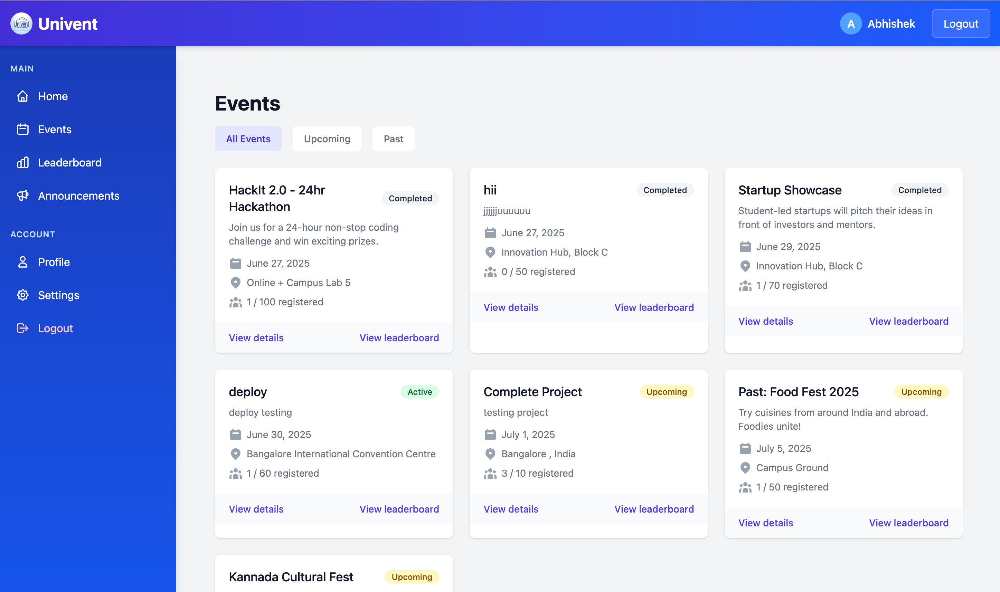
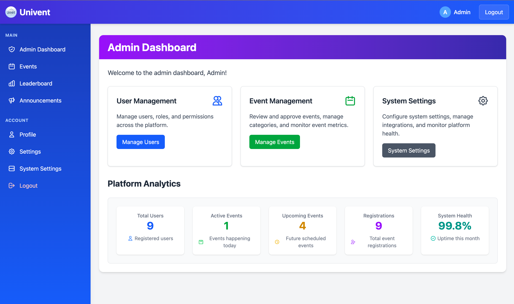
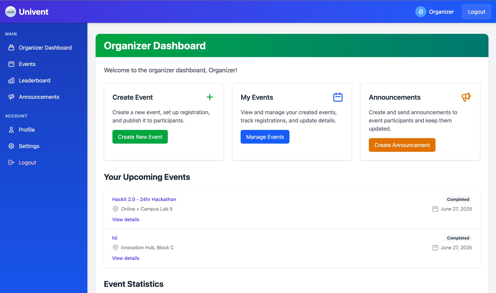
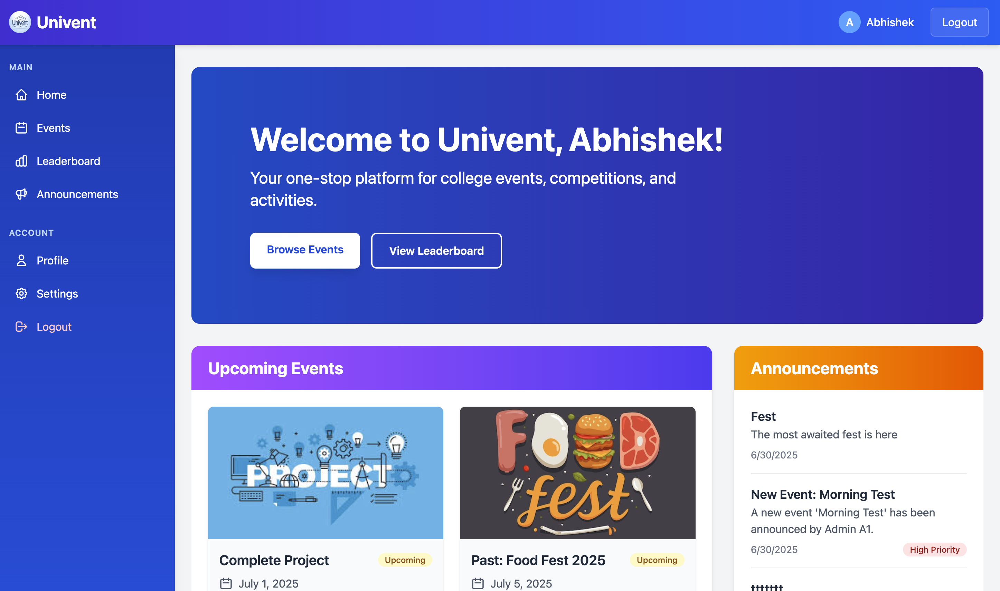

# Univent - Real-Time College Event Management System (MERN Stack)

<div align="center">
  
</div>

<p align="center">
  <a href="https://github.com/AbhishekBalija/Univent/blob/main/LICENSE"></a>
  <a href="#"></a>
  <a href="#"></a>
</p>

## 🚀 Overview
Univent is a comprehensive, real-time event management platform designed specifically for the dynamic environment of colleges and universities. Built on the **MERN stack (MongoDB, Express.js, React.js, Node.js)** with a **microservice architecture**, it provides a centralized system for organizing and participating in college fests, workshops, and technical events. The platform features live announcements and interactive leaderboards to boost engagement and streamline communication between organizers and participants.

This open-source project is a perfect example of a full-stack web application using modern technologies like **Socket.IO for real-time communication** and **JWT for secure authentication**.

## ✨ Key Features
Univent is packed with features to create a seamless event experience:

- 🎫 **Full Event Lifecycle Management**: Create, update, delete, and manage events.
- 📝 **Easy Participant Registration**: Simple, one-click event registration for students.
- 📢 **Real-time Announcements**: Push live updates and announcements to all users instantly.
- 🏆 **Live Gamified Leaderboards**: Dynamic leaderboards that update scores in real-time to foster competition.
- 👥 **Role-based Access Control (RBAC)**: Distinct roles for Admins, Organizers, and Participants with specific permissions.
- 📱 **Instant Notifications**: Real-time notifications for event registrations, updates, and more.
- 📊 **Event Analytics Dashboard**: Organizers can view registration statistics and engagement metrics.

<div align="center">
  
  <p><em>Event Management Interface for College Fests</em></p>
</div>

## 🛠️ Technology Stack
This project uses a modern and scalable technology stack:

- **Frontend**: **React.js** with **TailwindCSS** for a responsive and beautiful UI.
- **Backend**: **Node.js** with **Express.js** for building robust APIs.
- **Database**: **MongoDB** with Mongoose for flexible, schema-based data storage.
- **Real-time Communication**: **Socket.IO** for WebSocket-based live updates.
- **Authentication**: **JWT (JSON Web Tokens)** for secure, stateless authentication.
- **Containerization**: **Docker** and Docker Compose for easy setup and deployment.

## 🏛️ System Architecture
Univent is designed using a **microservice architecture** to ensure scalability, maintainability, and independent deployment of services. An **API Gateway** acts as a single entry point for all client requests, routing them to the appropriate downstream service.

- **Authentication Service**: Manages user registration, login, and JWT token generation.
- **Event Service**: Handles all CRUD operations for events and manages participant registrations.
- **Notification Service**: Powers real-time announcements and user notifications via Socket.IO.
- **Leaderboard Service**: Manages participant scoring, ranking calculations, and live leaderboard updates.

## 🏁 Getting Started

### Prerequisites
- Node.js (v14 or higher)
- MongoDB (v4.4 or higher)
- npm or yarn
- Docker (optional, for containerized setup)

### Installation Guide

1.  **Clone the repository:**
    ```bash
    git clone [https://github.com/AbhishekBalija/Univent.git](https://github.com/AbhishekBalija/Univent.git)
    cd univent
    ```

2.  **Install server and client dependencies:**
    ```bash
    # Install frontend dependencies
    cd frontend
    npm install

    # Install backend dependencies for each microservice
    cd ../backend
    cd auth-service && npm install
    cd ../event-service && npm install
    cd ../notification-service && npm install
    cd ../leaderboard-service && npm install
    ```

3.  **Environment Variables Setup:**
    Create a `.env` file in each service's root directory (`auth-service`, `event-service`, etc.) and add the required environment variables.
    ```bash
    # Example for auth-service/.env:
    MONGODB_URI=mongodb://localhost:27017/univent
    JWT_SECRET=your_super_secret_jwt_key
    PORT=8001
    ```

4.  **Run the Application:**
    ```bash
    # Option 1: Start all services using Docker (Recommended)
    docker-compose up

    # Option 2: Start each service and the frontend individually
    # Terminal 1: Auth Service
    cd backend/auth-service && npm run dev
    # Terminal 2: Event Service
    cd backend/event-service && npm run dev
    # ...and so on for other services

    # Terminal 5: Frontend
    cd frontend && npm start
    ```

## 👤 User Roles and Permissions

| Role | Access Level | Responsibilities |
|:--- |:--- |:--- |
| **Admin** | Full system access | Manages users, roles, and system-wide settings. |
| **Organizer** | Event-level access | Creates and manages their own events, tracks participants, makes announcements. |
| **Participant** | Basic access | Registers for events, views leaderboard, receives notifications. |

<div align="center">
  <table>
    <tr>
      <td align="center">
        <br>
        <em>Admin Dashboard</em>
      </td>
      <td align="center">
        <br>
        <em>Organizer Dashboard</em>
      </td>
      <td align="center">
        <br>
        <em>Participant Home</em>
      </td>
    </tr>
  </table>
</div>

## 📂 Project Structure
The repository is organized into a `frontend` directory for the React client and a `backend` directory containing the microservices.

```
univent/
├── frontend/             # React.js client application
│   ├── src/
│   ├── components/       # Reusable React components
│   ├── pages/            # Page-level components
│   └── services/         # API service functions
│
├── backend/
│   ├── auth-service/     # Handles user authentication & roles
│   ├── event-service/    # Handles event CRUD and registration
│   ├── notification-service/ # Real-time notifications via Socket.IO
│   ├── leaderboard-service/  # Manages scoring and ranking
│   └── gateway/          # API Gateway (e.g., Express Gateway)
│
└── docker-compose.yml    # Docker configuration for all services
```

## 📜 License
This project is licensed under the MIT License. See the [LICENSE](LICENSE) file for more details.
